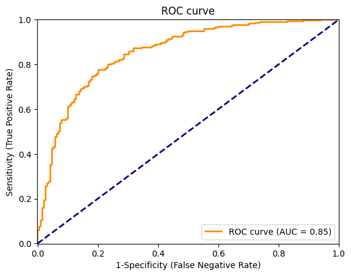

# Support Vector Machine (SVM) - Retention in Scholastic Travel Company
**Author:** Camilo Delgado Burbano  

## 📌 Project Description
This project implements a **Support Vector Machine (SVM)** model to predict student retention based on a dataset with 62 variables and 2389 rows.  
The workflow includes Exploratory Data Analysis (EDA), data preprocessing, categorical variable encoding, model training, hyperparameter tuning with GridSearchCV, and performance evaluation.  

---

## 📂 Files
- `SVM_CamiloDelgado.ipynb`: Main notebook with the full development of the assignment.  
- `03 CSV data -- STC(A)_numerical dates.csv`: Dataset used.-
---

## ⚙️ Workflow
1. **Exploratory Data Analysis (EDA)**
   - Review of variable types.  
   - Handling of missing values.  
   - Encoding categorical variables (One Hot Encoding).  

2. **Preprocessing**
   - Data normalization using `StandardScaler`.  
   - Train-test split.  

3. **Model Training**
   - Implementation of **SVM** with linear and radial kernels.  

4. **Hyperparameter Optimization with GridSearchCV**
   - Tuning of the `C` parameter.  
   - Cross-validation to select the best model.  

5. **Evaluation**
   - Confusion matrix.  
   - Metrics: Accuracy, Sensitivity, Specificity, Positive Predictive Value (PPV), Negative Predictive Value (NPV).  
   - ROC curve and AUC score.  

---

## 📊 Key Results
- Best value of **C** found with GridSearch: **`C = 1`**.  
- Model accuracy: **78%**  
- Balanced sensitivity and specificity, with an AUC of **85%**  

